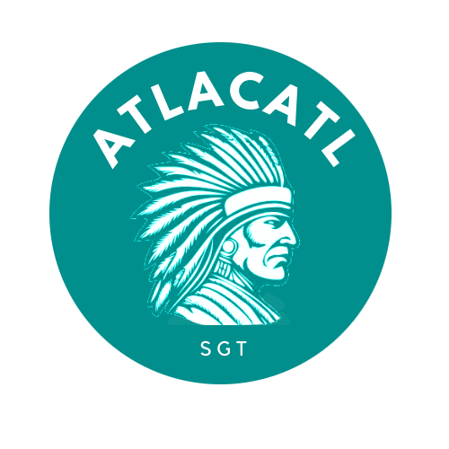
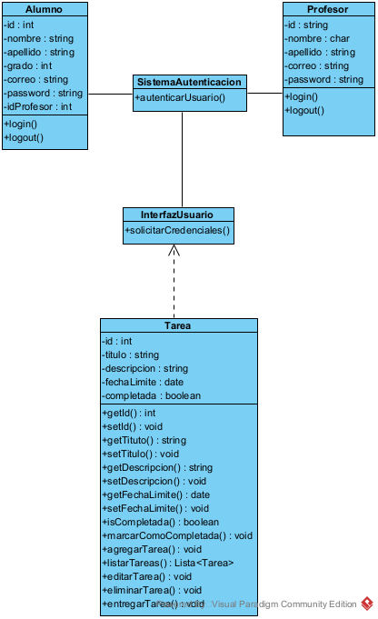
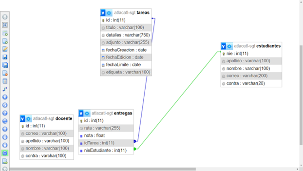
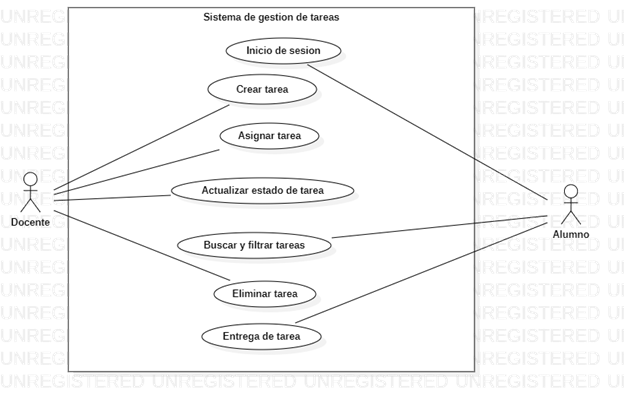
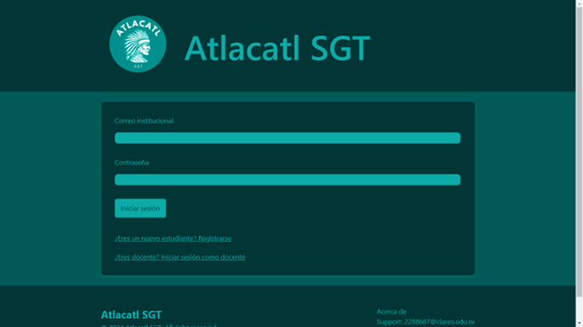
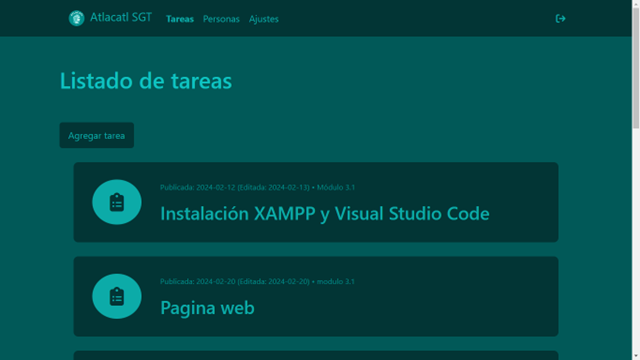

# Atlacatl SGT (Sistema de Gestión de Tareas)


   

## 📖 Descripción

**Atlacatl SGT** es una solución de software integral desarrollada para el **Instituto Nacional de Antiguo Cuscatlán (INAC)**. El sistema moderniza el proceso educativo del Tercer Año de Bachillerato Técnico Vocacional en Desarrollo de Software, proporcionando una alternativa personalizada y eficiente a plataformas genéricas como Google Classroom.

El proyecto aborda la necesidad de una gestión centralizada de asignaciones, calificaciones y entregas, adaptada específicamente al flujo de trabajo académico de la institución.

## ⚙️ Arquitectura y Diseño

El sistema fue construido siguiendo una arquitectura robusta y bien documentada. A continuación se presentan los diagramas clave que fundamentan la estructura del software.

### Diagrama de Clases

Representa la estructura estática del sistema y las relaciones entre las entidades principales (Usuarios, Tareas, Entregas).


### Modelo Entidad-Relación (ERD)

Diseño de la base de datos relacional MySQL, optimizada para la integridad referencial entre docentes, estudiantes y asignaciones.


### Casos de Uso

Visualización de las interacciones principales entre los actores (Docente/Estudiante) y el sistema.


## 🚀 Stack Tecnológico

| Categoría         | Tecnología        | Versión |
| :---------------- | :---------------- | :------ |
| **Backend**       | PHP               | 8.3     |
| **Base de Datos** | MySQL             | N/A     |
| **Frontend**      | HTML5 / CSS3 / JS | ES2023  |
| **Framework CSS** | Bootstrap         | 5.6     |
| **Entorno Local** | XAMPP             | 3.3.0   |
| **IDE**           | VS Code           | 1.90.2  |

## ✨ Funcionalidades Clave

### 👨‍🏫 Módulo Docente

-   **Gestión de Contenido (CRUD):** Creación, lectura, actualización y eliminación de tareas con soporte para archivos adjuntos.
-   **Sistema de Calificaciones:** Panel administrativo para evaluar entregas con precisión decimal (0.0 - 10.0).
-   **Control de Usuarios:** Gestión completa de los perfiles estudiantiles (NIE, Credenciales).
-   **Monitoreo:** Visualización en tiempo real del estado de entrega de cada estudiante.

### 👨‍🎓 Módulo Estudiante

-   **Entrega de Tareas:** Interfaz simplificada para la subida de archivos (PDF, DOCX, IMG).
-   **Gestión de Envíos:** Capacidad de anular o reemplazar entregas antes de la fecha de vencimiento.
-   **Dashboard Personal:** Acceso inmediato a tareas pendientes, calificaciones y feedback.

## 📸 Capturas de Pantalla

|         Login Docente          |            Panel de Tareas             |
| :----------------------------: | :------------------------------------: |
|  |  |

## 🔧 Instalación y Despliegue

Este proyecto está optimizado para despliegue en servidores Apache (XAMPP local o Hosting compartido).

1.  **Clonar el repositorio:**
    ```bash
    git clone [https://github.com/tu-usuario/atlacatl-sgt.git](https://github.com/tu-usuario/atlacatl-sgt.git)
    ```
2.  **Base de Datos:**
    -   Crear una base de datos en MySQL.
    -   Importar el script SQL ubicado en `/database/script.sql`.
3.  **Configuración:**
    -   Editar el archivo `Clases/Database.php`.
    -   Actualizar las credenciales (`$dbhost`, `$dbuser`, `$dbpass`, `$dbname`).
4.  **Ejecución:**
    -   Servir la aplicación desde `htdocs` (XAMPP) o subir vía FTP al directorio público del hosting.

## 👥 Equipo de Desarrollo

Proyecto desarrollado como parte del módulo de desarrollo de aplicaciones de software (INAC 2024):

-   **David Ernesto Lindo Argueta** - _Jefe de Equipo & Full Stack Dev_
-   **Ángel Josué Araujo Melara** - _Backend & Database_
-   **Dagoberto Ezequiel Pineda Castillo** - _Frontend & UI/UX_
-   **Héctor Alejandro Medrano Ceballos** - _QA & Testing_
-   **Víctor Guillermo Benítez Montoya** - _Documentación & Soporte_

---

© 2024 Atlacatl SGT. Todos los derechos reservados.
